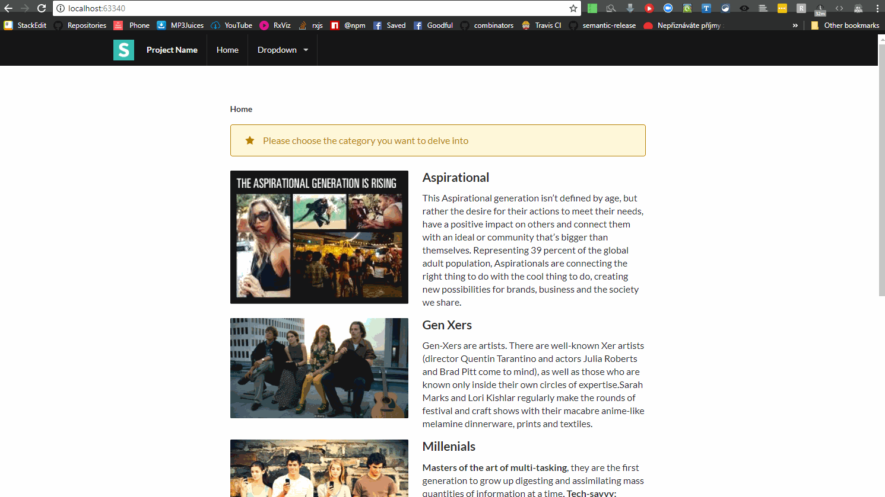
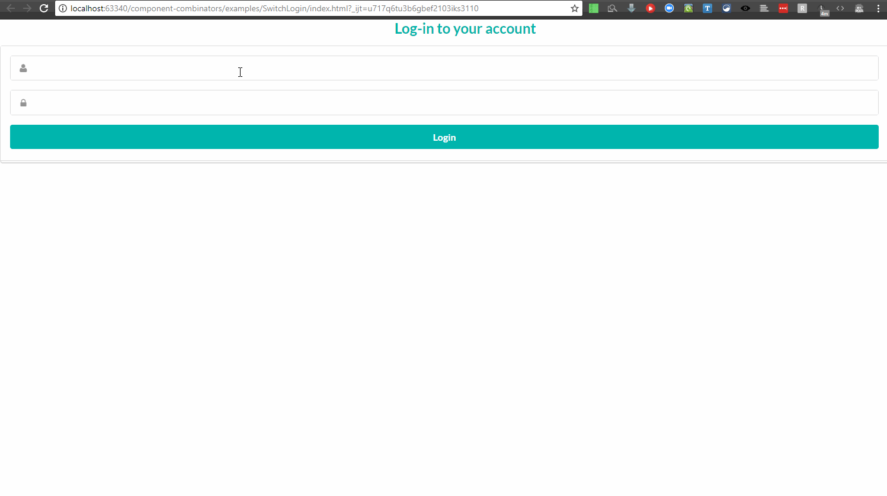
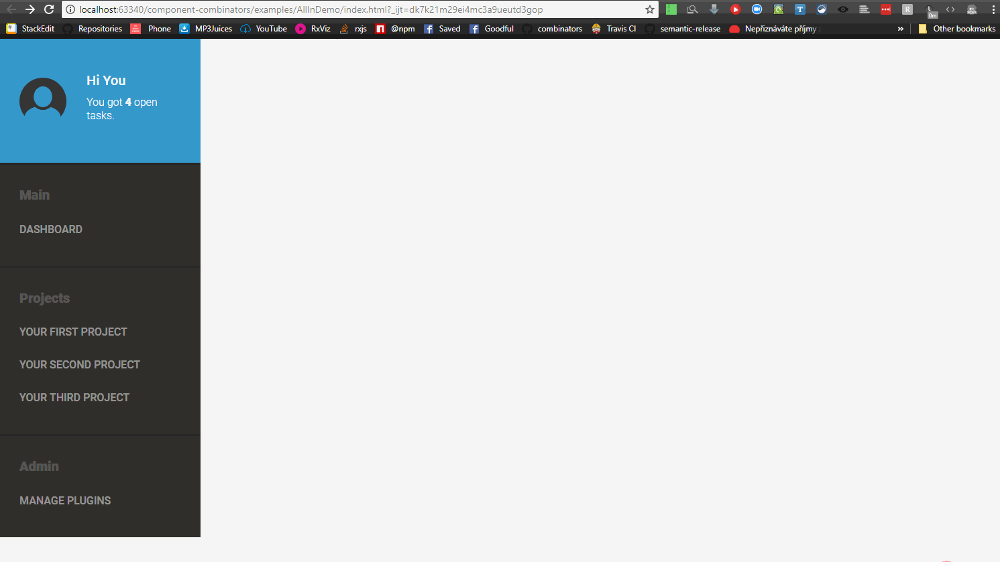

**Table of Contents**
<!-- Table of contents generated generated by http://tableofcontents.herokuapp.com/ -->
- [Motivation](#motivation)
- [So what is a component combinator?](#so-what-is-a-component-combinator)
- [Examples](#examples)
  - [Login gateway](#login-gateway)
  - [Nested routing](#nested-routing)
  - [Dynamically changing list of items](#dynamically-changing-list-of-items)
  - [Layouting](#layouting)
  - [Composing an app from components](#composing-an-app-from-components)
- [Roadmaps](#roadmaps)
  - [Roadmap v0.5](#roadmap-v05)
  - [Roadmap v0.4](#roadmap-v04)
- [Demos](#demos)
  - [Example application](#example-application)
  - [State Machine](#state-machine)
  - [Switch](#switch)
  - [OnRoute](#onroute)
  - [ForEach and List](#foreach-and-list)
- [Contribute](#contribute)
- [Known issues](#known-issues)

# Motivation
Around 18 months ago, while working on what is the largest cyclejs codebase I know of
(~20K lines of javascript), I realized how hard it was to actually make sense and maintain a
**large** cyclejs application. Focusing on those issues derived from cyclejs usage and 
compunded by application size:

- a large portion of the code was stream handling originating from the use of components and the
necessity to wire them together. The domain logic, and as a result, **the application logic was
lost** into a sea of streams' sometimes-cryptic operations.
- extra confusion about inputs (sources), their meanings and usage, due to **inputs addressing two
separate concerns** : component parameterization and interfacing with external systems. A bunch of
constants were lifted into streams in miscelleanous places to serve as parameters for generic
components, and that led to more stream arithmetic, noise, and in some occurences bugs
- **modifying, fixing and extending that code proved to be a gamble**, with any bug fixing or
debugging sessions counted in hours. To be fair, the complete absence of documentation (and tests) explained a lot of
that. The absence of unit tests itself could be explained by, well, the **pain** that it
is to write them with streams in the middle, which led to resorting to sometimes
brittle, often slow, selenium-based end-to-end tests.
- hard to figure out **quickly, with certainty** the exact workflow that the application was
implementing (you know, multi-step processes where any step may fail and you need to backtrack), let
 alone add new logical branches (error recovery...)

And yet, while that application was large, it cannot really be said to be an exceptionally complex
application. Rather it was the standard CRUD application which is 90% of business applications today. No fancy animations, adaptive ui as the only ux trick, otherwise mostly fields and forms, a remote database, and miscellaneous domain-driven workflows.

This was the motivation behind my dedicating my (limited) free time to add the missing
capabilities to the framework. I singled out those four areas :
 componentization, visual debugging, testing, concurrency control. I am happy that finally the
 first step is in a sufficient state of progress that it can be shared.

 **That first step is a componentization model for cyclejs**, that builds upon the original idea
 of a component as a function and extends it further. Components are (mostly) what they used to
 be. Components can however now be parameterized through a dedicated argument `settings`,
 capturing the **component's parameterization concern**, and which is inherited down the component
 tree. Components, importantly, can be built through a series of **component combinators** which eliminate a lot of stream noisy, repetitive code. Those
  component combinators have been extracted and  abstracted from the 20K lines of code, so they should cover a large number of cases that one
  encounters. The proposed component model could be seen in many ways as a **generalization of that
   of `React`**, extending it to handle concerns other than the view, which opens the door to using a `JSX`-like syntax if you so fancy. The component model also sets up the work for tracing and visualization tools for the second step, **without any
  modification of cyclejs internals.**

This is really a working draft, akin to a proof of concept. Performance was not at all looked upon,
combinators only work with rxjs, the version of cycle used brings us back to the time
when cyclejs could still be considered a library (vs. a framework), build is not optimized,
`console.log`s are all over the place, **only tested on chrome evergreen**, etc.

It works nicely though. It succeeds in providing a **higher-level abstraction** so you can focus on
the **interdependence** of components that defines the user interface **logic**, rather than having
 to constantly fiddle with a large amount of **implementation details**.

Each combinator features (and if not, will feature) a dedicated non-trivial example of use, and is
documented and tested. A sample application is available to showcase how combinators work
together with components to build a non-trivial application.

**A series of articles covers the theoretical underpinning** in more details (read
chronologically, they constitute a long read, but I think they are very interesting). A [specific article](http://brucou.github.io/posts/applying-componentization-to-reactive-systems---sample-application/) shows the
step-by-step building of the showcased sample application. A shorter introduction can be found in the `README` for the repository.

# So what is a component combinator?
A component combinator is a **parametrizable** function which... **combines** components. To each
 combinator will correspond a different combining logic. For instance, the `ListOf` combinator 
 will take two components, and will admit a stream source name as parameter, which emits arrays 
 (for instance `ListOf({list:..., as:...}, [C1, C2])`). The combined component will activate the 
 `C1`  component whenever the source emits an empty array, and a combined list of `C2` components 
 otherwise. So here the combining logic follows an iteration logic. 
 
 The simplest of those 
 combinator is `Combine` (for instance `Combine{{...}, [C0, [C1, C2]]}`), whose DOM sink is 
 the result of merging `Cx` DOM sinks **into** `C0` DOM sink; and whose non-DOM sinks are 
 the merge of the respective `Cx` non-DOM sink.
 
The principle is deceptively simple. Now let's see some examples of use.

# Examples
## Separating layout from feature
The following implementation corresponds to the layout specifications :

- layout specifications (in order from top to bottom of appearance on screen)
    - header
    - feature : we will reuse here the component from the nested routing demo (introduced in a 
    later section)
    - footer
      - made of three groups (with miscellaneous navigation links) and a header
    - sitemap

The application would be correspondingly broken down as follows :

```javascript
function LayoutContainer(sources, settings) {
  return {
    [DOM_SINK]: $.of(div([
      div(".ui.fixed.inverted.menu", { "slot": "header", }, []),
      div(".ui.main.text.container", { "slot": "body", }, []),
      div(".ui.inverted.vertical.footer.segment", { "slot": "footer", }, []),
    ]))
  }
}

export const App = Combine({}, [LayoutContainer, [
  InSlot('body', [Feature]),
  InSlot('header', [Header]),
  InSlot('footer', [Footer]),
]]);
```

The `Footer` component itself is broken down as follows :

```javascript
function FooterContainer(sources, settings) {
  return {
    [DOM_SINK]: $.of(
      div([
        div(".ui.center.aligned.container", [
          div(".ui.stackable.inverted.divided.grid", [
            div(".three.wide.column", { slot: 'group1' }, []),
            div(".three.wide.column", { slot: 'group2' }, []),
            div(".three.wide.column", { slot: 'group3' }, []),
            div(".seven.wide.column", { slot: 'footer_header' }, [])
          ]),
          div({ "slot": "sitemap" }, [])
        ]),
      ])
    )
  }
}

export const Footer = Combine({}, [FooterContainer, [
  InSlot('group1', [FooterGroup1]),
  InSlot('group2', [FooterGroup2]),
  InSlot('group3', [FooterGroup3]),
  InSlot('footer_header', [FooterHeader]),
  InSlot('sitemap', [Sitemap]),
]]);
```

By using a 
container component which specifies where to distribute the DOM content of children components, it
 is possible to : separate layout concerns from feature concerns ; break down layout 
concern into smaller concerns in a organized, readable and maintainable way. The breakdown can be
 realized so that future layout changes mostly impact the `LayoutContainer` component.

The content distribution mechanism we use is the **slot mechanism** made popular by web 
components. Container components declare slots, and children components fill those slots with 
content (the `InSlot` combinator is one way to associate a slot to a component).



Note that **all component combinators use the same default** for merging children components' sinks 
(whether DOM sinks or non-DOM sinks). Those defaults have been extracted for our large oodebase 
and seem to cover the vast majority of the patterns which occurred in that codebase.

Two things can already be noted here : we haven't had to write **any** merging code by hand, and 
the structure of our application is more self-evident, i.e. simpler to read.

Let's now see another example, which addresses a very fundamental need of web application.

## Nested routing
The following implementation corresponds to :

- Functional specifications
    - user visits '/' -> display home page
        - home page allows to navigate to different sections of the application
    - when the user visit a given section of the application
        - a breadcrumb shows the user where he stands in the sitemap
        - a series of clickable cards is displayed
            - when the user clicks on a given card, details about that card are displayed, and corresponding to a specific route for possible bookmarking
- Technical specifications
    - `HomePage` takes the concern of implementing the home page logic.
    - `Card` is parameterized by its card content, and is in charge of implementing the card logic
    - `CardDetail` is parameterized by its card content, and is in charge of displaying the extra details of the card

```javascript
export const App = InjectSourcesAndSettings({
  sourceFactory: injectRouteSource,
  settings: {
    sinkNames: [DOM_SINK, 'router'],
  }
}, [
  OnRoute({ route: '' }, [
    HomePage
  ]),
  OnRoute({ route: 'aspirational' }, [
    InjectSourcesAndSettings({ settings: { breadcrumbs: ['aspirational'] } }, [
      AspirationalPageHeader, [
        Card(BLACBIRD_CARD_INFO),
        OnRoute({ route: BLACK_BIRD_DETAIL_ROUTE }, [
          CardDetail(BLACBIRD_CARD_INFO)
        ]),
        Card(TECHX_CARD_INFO),
        OnRoute({ route: TECHX_CARD_DETAIL_ROUTE }, [
          CardDetail(TECHX_CARD_INFO)
        ]),
        Card(TYPOGRAPHICS_CARD_INFO),
        OnRoute({
          route: TYPOGRAPHICS_CARD_DETAIL_ROUTE,
        }, [
          CardDetail(TYPOGRAPHICS_CARD_INFO)
        ]),
      ]])
  ]),
]);
```


The (gory) nested routing switching logic is hidden behind the `OnRoute` combinator. With that out
 of the way, the routing logic can be expressed very naturally (in a very similar way to React
router's [dynamic routing](https://reacttraining.com/react-router/core/guides/philosophy/dynamic-routing), in which the router is a component
like any other). There is no pre-configuration of routes, outside of the application. Routes are
directly and naturally included in their context.

Let's move on to cases exemplifying simple control flow logic (branching).

## Login gateway
For instance, specification for a login section of an application could go as such:

- Functional specifications
    - if user is logged, show the main page
    - if user is not logged, show the login page, and redirect to `index` route when login is performed
- Technical specifications
    - `MainPage` takes the concern of implementing the main page logic.
    - `LoginPage` is parameterized by a redirect route, and is in charge of logging in the user
    - `convertAuthToIsLoggedIn` emits `IS_NOT_LOGGED_IN` or `IS_LOGGED_IN` according to whether the user is logged or not



A tentaive code to implement those specification with our library would look like :

```javascript
export const App = Switch({
  on: convertAuthToIsLoggedIn,
  as : 'switchedOn',
}, [
  Case({ when: IS_NOT_LOGGED_IN }, [
    LoginPage({ redirect: '/component-combinators/examples/SwitchLogin/index.html?_ijt=7a193qn02ufeu5it8ofa231v7e' })
  ]),
  Case({ when: IS_LOGGED_IN }, [
    MainPage
  ]),
]);
```

The same code could be written in a `JSX`-like dialect as :

```javascript
export const App =
  <Switch on=convertAuthToIsLoggedIn as='switchedOn'>
      <Case when=IS_NOT_LOGGED_IN>
        <LoginPage redirect='/component-combinators/examples/SwitchLogin/index.html?_ijt=7a193qn02ufeu5it8ofa231v7e'/>
      </Case>
      <Case when=IS_LOGGED_IN>
        <MainPage />
      </Case>
  </Switch>
```

The same code could also be written in a dedicated DSL :

```javascript
export const App = dsl`
  Switch On ${convertAuthToIsLoggedIn} (As switchedOn)
    When ${IS_NOT_LOGGED_IN} :
      LoginPage {redirect:'/component-combinators/examples/SwitchLogin/index.html?_ijt=7a193qn02ufeu5it8ofa231v7e'}
    When ${IS_LOGGED_IN} :
      MainPage
`
```

Syntax, whichever chosen (we will work only with the first one) is but a detail.
What is important here is that :

- the stream wiring concern has disappeared within the `Switch` combinator (i.e. has been
abstracted out), while the user interface logic can be written in a way which is very close to its specification, hence easier to
understand and check for correctness
- The developer cannot make any mistake in the stream switching logic, nor
does he have to check while debugging that the error does not come from an erroneous switch
handling. Provided that the `Switch` combinator has been properly implemented and tested, the
corresponding concern is out of the way.
- A debugging developer can narrow down a cause of misbehaviour for example by selectively
modifying arguments, deleting branches of the component tree, stubbing components, etc. That is, reasoning, investigating can be made at a component level first, before, if necessary, going at the lower stream level.

Next, we have a look at complex control flow logic (branching, jumping, looping, etc.).

## Multi-step workflow
The specification for a multi-step application process, as coming from designer team, are as 
follows :


We have here a sequence of screens, with conditional transitioning logic according to the state 
of the application. That logic is later refined in parallel with the dev team to take the final 
control flow form :


We won't include code example here for the sake of brevity. The previous graph is specified 
in the form of a state machine, passed to the `EFSM` component combinator. We refer however the 
curious reader to :

- [demo repo](https://github.com/brucou/component-combinators/tree/master/examples/volunteerApplication)
- [The case for state machines in UI programming](http://brucou.github.io/projects/component-combinators/efsm---the-case-for-ui-programming/)
- [EFSM combinator - documentation](http://brucou.github.io/projects/component-combinators/efsm---documentation/)
- [http://brucou.github.io/projects/component-combinators/efsm---example-application/](http://brucou.github.io/projects/component-combinators/efsm---example-application/).
 
Let's attack dynamic lists.

## Dynamically changing list of items

The following implementation corresponds to :

- Functional specifications
    - display a list of cards reflecting input information from a card database
    - a pagination section allows to display X cards at a time
- Technical specifications
    - `Card` is parameterized by its card content, and is in charge of implementing the card logic
    - `Pagination` is in charge of the page number change logic

```javascript
export const App = InjectSources({
  fetchedCardsInfo$: fetchCardsInfo,
  fetchedPageNumber$: fetchPageNumber
}, [
  ForEach({
      from: 'fetchedCardsInfo$',
      as: 'items',
      sinkNames: [DOM_SINK],
    }, [AspirationalPageHeader, [
      ListOf({ list: 'items', as: 'cardInfo' }, [
        EmptyComponent, // Component activated in case list is empty
        Card, // // Component activated otherwise
      ])
    ]]
  ),
  ForEach({
    from: 'fetchedPageNumber$',
    as: 'pageNumber',
    sinkNames: [DOM_SINK, 'domainAction$']
  }, [
    Pagination
  ])
]);
```


The reactive update (on `fetchedCardsInfo$`) and iteration logic (on the array of items received
from `fetchedCardsInfo$`) are taken care of with the `ForEach` and the `ListOf` combinators.

Same as always, there is no gory stream-merging code in the way of understanding the application 
logic. Furthermore, edge cases attached to the iteration logic are already conveniently taken care
 of.

However, in a real application, the existing combinator list will never cover the full spectrum of 
combining logics (being that essentially infinite). Our library however seeks to cover most of the 
**generic** needs arising. For those **specific** needs not covered, our library also includes a 
component combinator **factory**, the same one from which all existing combinators are 
actually derived. Let's see other combinators and our combinator factory at work through an example.

## Composing an app from components
The original point of the combinator library is to compose an application by building it from 
components. In the previous sections, we have shown some combinators handling logic, and control 
flow. There are other combinators handling state injection and interface adaptation, so that inputs
 can be adapted to an existing component interface (imagine web components with a predefined event (`sources`) and 
 property interface (`settings`)), fostering **reuse**. New component combinators can be created 
 thanks to our generic component combinator factory `m`.

Taking a page from our [showcased sample application](https://i.imgur.com/NXgJV2c.png), it looks 
like this (only tidbits, for full code see the [example repo](https://github.com/cyclejs-community/component-combinators/tree/master/examples/AllInDemo)):
 
 ```javascript
App = Combine({}, [
  SidePanel,
  MainPanel
]);

SidePanel =
  Combine({}, [Div('.app__l-side'), [
    Navigation({}, [
      NavigationSection({ title: 'Main' }, [
        NavigationItem({ project: { title: 'Dashboard', link: 'dashboard' } }, [])
      ]),
      NavigationSection({ title: 'Projects' }, [
        InSlot('navigation-item', [ListOfItemsComponent])
      ]),
      NavigationSection({ title: 'Admin' }, [
        NavigationItem({ project: { title: 'Manage Plugins', link: 'plugins' } }, [])
      ]),
    ])
  ]]);
```

Displaying the list of items requires to get the item from a source. That source is passed 
through `InjectSources` :

```javascript
const ListOfItemsComponent =
  InjectSources({ projectNavigationItems$: getProjectNavigationItems$ }, [
    ForEach({ from: 'projectNavigationItems$', as: 'projectList' }, [
      ListOf({ list: 'projectList', as: 'project' }, [
        EmptyComponent,
        NavigationItem
      ])
    ])
  ]);
  
function getProjectNavigationItems$(sources, settings) {
   return sources.projects$
     .map(filter(project => !project.deleted))
     .map(map(project => ({
       title: project.title,
       link: ['projects', project._id].join('/')
     })))
     .distinctUntilChanged()
     // NOTE : this is a behaviour
     .shareReplay(1)
     ;
}
``` 



Note the use of the ad-hoc combinators `Navigation`, `NavigationSection` and `NavigationItem`. 
They are for instance defined as :

```javascript
// Components
// Navigation(..., [NavigationSection(..., [NavigationItem(...,[])])])
function NavigationContainerComponent(sources, settings) {
  const { user$, projects$ } = sources;
  // combineLatest allows to construct a behaviour from other behaviours
  const state$ = $.combineLatest(user$, projects$, (user, projects) => ({ user, projects }))

  return {
    [DOM_SINK]: state$.map(state => {
      return div('.navigation', [
        renderTasksSummary(state),
        nav({ slot: 'navigation-section' }, [])
      ])
    })
  }
}

function Navigation(navigationSettings, componentArray) {
  return m({}, (navigationSettings, [NavigationContainerComponent, componentArray])
}
```

This is the first introduction of the `m` component combinator factory. We will not expand here 
on the specifications for `m`, that is done in the corresponding [documentation](http://brucou.github.io/projects/component-combinators/mm/).  It suffices to know that the first argument of `m` specifies the combining logic and that `Combine` is actually 
the partial application of `m` with an empty object (i.e. default combining logic is used). The 
`Navigation` component could for instance also be written as :

```javascript
function Navigation(navigationSettings, componentArray) {
  return Combine(navigationSettings, [NavigationContainerComponent, componentArray])
}
```

Unless you have to implement some very specific combining logic that we haven't met in our large 
codebase, you should not have to use `m` in another form than `Combine`. If that should happen, 
you will need to delve into the documentation where we detail the three strategies we use for 
combining components. If you come up with a useful component combinator that is not here, feel 
free to publish it in its own package.

While the full syntax and semantics of the component combinators haven't been exposed[^EFSM], 
hopefully the examples serve to portray the merits of using a component model, under which an 
application is written as a component tree, where components are glued with convenient component combinators
  covering frequently occuring patterns. I certainly think it is simpler to write, and more 
  importantly, simpler to **read, maintain and debug**.

Let's have a proper look at combinators' syntax and the available combinators extracted from the
20K-line cyclejs codebase.

# Combinators
## Syntax
In general combinators follow a common syntax :

- `Combinator :: Settings -> ComponentTree -> Component`
    - `Component :: Sources -> Settings -> Sinks`
    - `ComponentTree :: ChildrenComponents | [ContainerComponent, ChildrenComponents]`
    - `ContainerComponent:: Component`
    - `ChildrenComponents :: Array<Component>`

## Combinator list
The proposed library has the following combinators :

| Combinator      | Description |
| --------- | :-----|
| [Combine](http://brucou.github.io/projects/component-combinators/Combine/)      |    The simplest combinator, which traverses a component tree, applying default merge functions to components' sinks along the way. Distinguishes between DOM sink and non-DOM sink, and implements a slot mechanism for merging DOM sinks |
| [InSlot](https://brucou.github.io/projects/component-combinators/inslot/) | Assign DOM content to a slot ([a la web component](https://alligator.io/web-components/composing-slots-named-slots/))|
| [OnRoute](http://brucou.github.io/projects/component-combinators/router/)      |    Activate a component based on the route changes. Allows nested routing. |
| [Switch](http://brucou.github.io/projects/component-combinators/switch/)  | Activate component(s) depending on the incoming value of a source|
| [FSM](http://brucou.github.io/projects/component-combinators/efsm---example-application/)      |    Activate components based on inputs, and current state of a state machine. Allows to implement a flow of screens and actions according to complex control flow rules.  |
| [ForEach](http://brucou.github.io/projects/component-combinators/foreach/)     |   Activate component for each incoming value of a source|
| [ListOf](http://brucou.github.io/projects/component-combinators/listof/)      |    Activate a list of a given component based on an array of items |
| [Pipe](https://brucou.github.io/projects/component-combinators/pipe/)      |    Sequentially compose components |
| [InjectSources](http://brucou.github.io/projects/component-combinators/injectsources/)      |    Activate a component which will be injected extra sources |
| [InjectSourcesAndSettings](http://brucou.github.io/projects/component-combinators/injectsourcesandsettings/)      |    Activate a component which will receive extra sources and extra settings |
| [m](http://brucou.github.io/projects/component-combinators/mm/)      |    The core combinator from which all other combinators are derived. `m` (for *merge*) basically traverses a component tree, applying default or provided reducing functions along the way.  |

Documentation, demo and tests for each combinator can be found in their respective repository.

# Theoretical background
The theoretical underpinnings can be found as a series of articles on my [blog](https://brucou.github.io/) :

- [user interfaces as reactive systems](https://brucou.github.io/posts/user-interfaces-as-reactive-systems/)
- [componentization against complexity](https://brucou.github.io/posts/componentization-against-complexity/)
- [a componentization framework for cyclejs](https://brucou.github.io/posts/a-componentization-framework-for-cyclejs/)
- [applying componentization to reactive systems : sample application](https://brucou.github.io/posts/applying-componentization-to-reactive-systems---sample-application/)
- [Component models for user interfaces implementation - a comparison](http://brucou.github.io/posts/component-models-for-user-interfaces-implementation---a-comparison/)

# Documentation
Documentation for component combinators and drivers can be found in the [projects portion](https://brucou.github.io/projects/component-combinators/) of my blog.

# Installation
## Packages
The following packages are available :

| Package          | Description                                                                                                                          |
|------------------|--------------------------------------------------------------------------------------------------------------------------------------|
| @rxcc/components | Contains the core component combinators                                                                                              |
| @rxcc/drivers    | Exposes a few useful drivers, in particular drivers to handle command and queries on a domain, and read the DOM state                |
| @rxcc/testing    | Mocks for the provided drivers, and the testing library used for testing the components combinators                                  |
| @rxcc/contracts  | A bunch of predicates and utility functions to handle contract checking and assertions                                               |
| @rxcc/utils      | Miscellaneous utility functions (debugging, component helpers, etc.) |
|                  |                                                                                                                                      |

Any of those can be installed with `npm`. For instance :

```javascript
npm install @rxcc/components
```

 # Tests
 Tests are performed with good old `QUnit`, i.e. in the browser. This allows debugging code in the 
 browser, and also the possbility in a debugging session to actually display some components' output directly in
 the DOM (vs. looking at some virtual representation of the DOM). To run the available tests, in
 the root directory, type :

 - `npm install`
 - `npm run build-node-test`
 - have a look at `/test/index.js` to pick up which test you want to run (400+ tests available in
  total)
 - `npm run test`
 - then open with a local webserver the `index.html` in `test` directory

# Roadmaps

## Roadmap v0.5
<details>
  <summary>Details</summary>

The core target of this release will be to prepare the architecture for visual tracing, and
specify the (visual) shape that this should take. A small proof of concept should be produced. A
secondary target is to start a very basic UI component library, not going over the proof of
concept level.

The current roadmap for the v0.5 stands as :

- Core
    - robustness of settings :
      - in some cases, should be inherited down the tree, in other cases should be private (find
      a nice syntax). That creates complexity but reduces bug surface so worth it.
      - very important bug possibility which is facilitated as of now : a settings could be set at 
      some location in the tree, and then read wrongly at another location of the tree because they
      have the same name. that prevents from using default values for settings, the default value
       could be wrongly overridden by settings inherited from up the tree.
         - as of now, expected settings SHOULD be mandatory and SHOULD be namespaced to avoid
         collisions
    - external system's state reading
      - [ ] `document` driver reads synchronously a **value** from the DOM. That is possible
      because DOM database is **local**. Value whether to uniformize read mechanism by having them
      all returning `Observable`. That should enable **simpler** tracing!!
    - see what can be done to have a better concurrency model (i.e. beyond FSM)
    - [ ] type contracts error handling for component's settings (which types of component
    combinator expects, types of settings, etc.)
    - error management :
      - [ ] [error boundaries?](https://reactjs.org/docs/error-boundaries.html)
      - [ ] error logging (use chrome's console.context? replace string formatting for console?)
      - [ ] improve error reporting (human-readable message, add guards, include blame information
      in the form of erroneous arguments)
    - [ ] logging and visualization (!)
    - [ ] conversion to web components
- Component library
  - [ ] a small one with the basics - should be able to copy a lot from react?
    - so many of them, https://bosonic.github.io/elements/dialogs-modals.html, cf.
    materializecss, etc.
- Drivers library
  - analyze benefits of immutability for store drivers
  - rename Action driver to Command driver, to make it obvious this is Command and Query separation
- Demo
  - [ ] continue to complete demo from Angular2 book on github site
  - [ ] [Real world app?](https://github.com/gothinkster/realworld)
- Testing
    - [ ] Model-based testing for FSM, i.e. automatic test cases generation
    - [ ] study testing with pupeeteer.js (chrome headless browser) -- cypress looks quite good too
    - [ ] improve API for `runTestScenario` to make it less verbose
- Combinators
    - [ ] [Portal](https://reactjs.org/docs/portals.html) combinator (render DOM in a specific location)
    - [ ] `Catch` combinator? cf. Core -- error management
    - [ ] Switch combinator
      - [ ] cover the `default:` part of switch statement
    - [ ] State machine combinator `FSM`
      - [ ] convert FSM structure to graphml or dot or tgf format
      - [ ] automatic generation of graphical representation of the FSM
      - [ ] refactor the asynchronous FSM into synchronous EHFSM + async module
        - this adds the hierarchical part, improvement in core library are automatically translated in improvement to this library, and closed/open principle advantages
      - [ ] investigate prior art for reuse opportunities
        - https://github.com/jbeard4/SCION
        - http://blog.sproutcore.com/statecharts-in-sproutcore/
    - [ ] Event combinator `WithEvents` to think about (specifications? cf. current `mEventFactory`)
    - [ ] State combinator `WithState` to think about (specifications? rationale?)
    - [ ] Action combinator `ComputeActions` to think about (specifications? rationale?)
- Distribution
  - [ ] monorepo?
  - [ ] individual combinator packages?

</details>


## Roadmap v0.4
Please note that library is still wildly under development :

- APIs ~~might~~ will go through breaking changes
- you might encounter problems in production
- performance has not been investigated as of yet

The current roadmap for the v0.4 stands as :

- Core
    - [x] component model
    - [x] DOM merge with slot assignment (a la web component)
    - [x] documentation for a-la-web-component slot mechanism
      - [non-technical](https://css-tricks.com/intro-to-vue-2-components-props-slots/), or
     https://skyronic-Demo.com/blog/vue-slots-example
    - [x] documentation combinators
    - [x] nice blog site : github pages?
      - [x] select static site generator (Jekyll, Hexo, Hugo)
      - [x] blog site architecture
      - [x] theoretical underpinnings
    - [x] implement relevant part of sample application taken from Angular2 book
- Testing
    - [x] Testing library `runTestScenario`
    - [x] Mocks for DOM and document driver
    - [x] Mock for domain query driver
- Combinators
    - [x] Generic combinator `m`
    - [x] combinator `Combine`
    - [x] Routing combinator `onRoute`
    - [x] Switch combinator
      - [x] `Switch`
      - [x] `Case`
    - [x] State machine combinator `FSM`
    - [x] ForEach combinator `ForEach`
    - [x] List combinator `ListOf`
    - [x] Injection combinator
      - [x] `InjectSources`
      - [x] `InjectSourcesAndSettings`
    - [x] Query driver
    - [x] Action driver
    - [x] sequential composition combinator (`Pipe`)


# Demos
## Example application
The example application is taken from the book [Mastering Angular2 components](https://www.packtpub.com/web-development/mastering-angular-2-components). Cf. [screenshot](https://brucou.github.io/posts/a-componentization-framework-for-cyclejs/#example) here.

- sits in `examples/AllInDemo` directory
- `npm install`
- `npm run wbuild`
- then open with a local webserver the `index.html` in `$HOMEDIR/examples/AllInDemo` directory

## State Machine
- go to `$HOMEDIR/examples/volunteerApplication`
- `npm install`
- `npm run wbuild`
- then open with a local webserver the `index.html` in `$HOMEDIR/examples/volunteerApplication` directory

## Switch
- go to `$HOMEDIR/examples/SwitchLogin`
- `npm install`
- `npm run wbuild`
- then open with a local webserver the `index.html` in `$HOMEDIR/examples/SwitchLogin` directory

## OnRoute
- go to `$HOMEDIR/examples/NestedRoutingDemo`
- `npm install`
- `npm run wbuild`
- then open with a local webserver the `index.html` in `$HOMEDIR/examples/NestedRoutingDemo` directory

## ForEach and List
- go to `$HOMEDIR/examples/ForEachListDemo`
- `npm install`
- `npm run wbuild`
- then open with a local webserver the `index.html` in `$HOMEDIR/examples/ForEachListDemo` directory

# Contribute
Contribution is **welcome** in the following areas :

- devops
  - monorepos
  - whatever makes sense to make the repository more manageable
- reducing build size

# Known issues
That is a paragraph that I am sure will grow with time :-)
